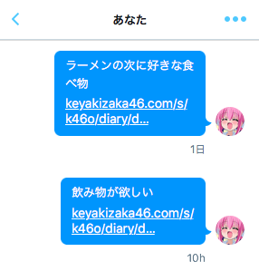

# Keyakify



Keyakify notifies you the update of your favorite keyakizaka 46 member's blog via Twitter's DM.

## Setup

Write `config/default.json`.

* Twitter API keys (`consumerKey`, `consumerSecret`, `accessTokenKey`, `accessTokenSecret`)
* `parent` is the top page of your favorite member's blog
* `target` is the destination of DM

```json
{
	"consumerKey": "xxxxxxxxxxxxxxxx",
	"consumerSecret": "xxxxxxxxxxxxxxxx",
	"accessTokenKey": "xxxxxxxxxxxxxxxx",
	"accessTokenSecret": "xxxxxxxxxxxxxxxx",
	"parent": "http://www.keyakizaka46.com/s/k46o/diary/member/list?ima=0000&ct=28",
	"target": "screen_name"
}
```