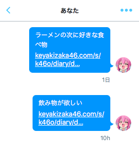

# Zelkova Sample



Notify you via Twitter's DM.

## Setup

Write `config/default.json`.

* Twitter API keys (`consumerKey`, `consumerSecret`, `accessTokenKey`, `accessTokenSecret`)
* `target` is the destination of DM

```json
{
	"twitter": {
		"consumerKey": "xxxxxxxxxxxxxxxx",
		"consumerSecret": "xxxxxxxxxxxxxxxx",
		"accessTokenKey": "xxxxxxxxxxxxxxxx",
		"accessTokenSecret": "xxxxxxxxxxxxxxxx",
	},
	"target": "screen_name"
}
```

## Run

```
node index.js
```